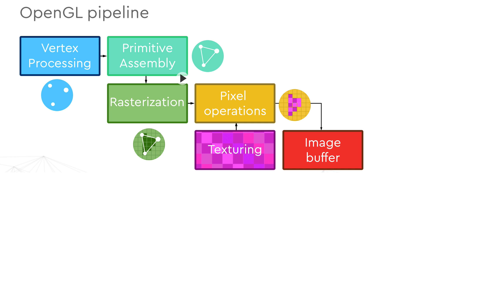
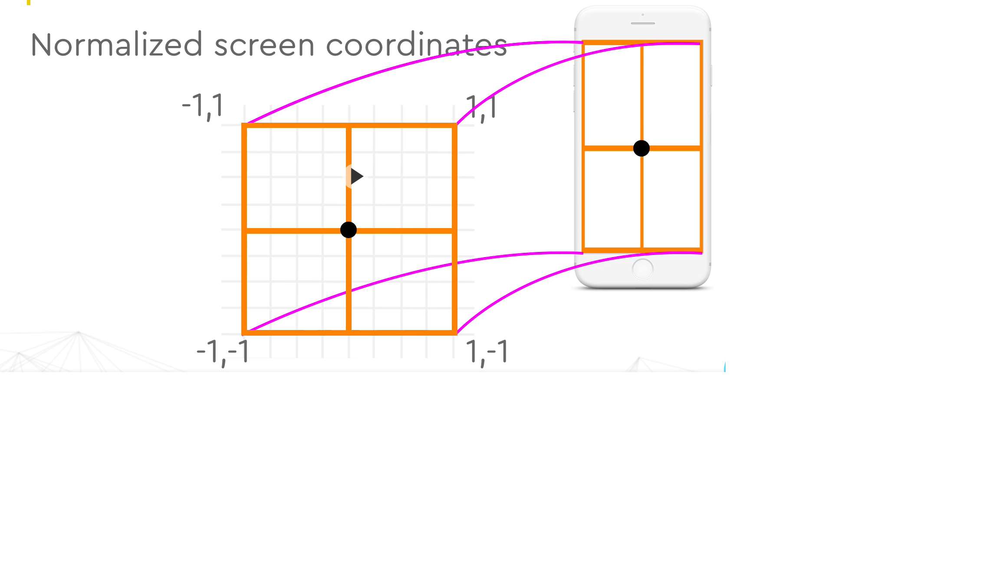

# OpenGL Basic Concepts
- OpenGL is a **state machine.**
- This state machine has its own internal memory concept called : **OpenGL Context**

| **Open GL Context** |
|--------|
|Rendering Options|
|Pixel Buffer|
|Vertex Buffer|
|.....|
|Shader #122|
|Texture #5|

- OpenGL follows the Client/Server API Model.
- e.g API
- ```
  {  
    unsigned int buffid;
    glGenBuffers(1, &buffid);
  }
  ```
  
  
## OpenGL Pipeline


## OpenGL Normalized Screen Coordinates



--------
- cross Platform C Based API
- no windowing system support
  - we need platform specific bindigns here to tap display, e.g glfw. OpenGL only concerns with Rendering.
- different versions
-------
