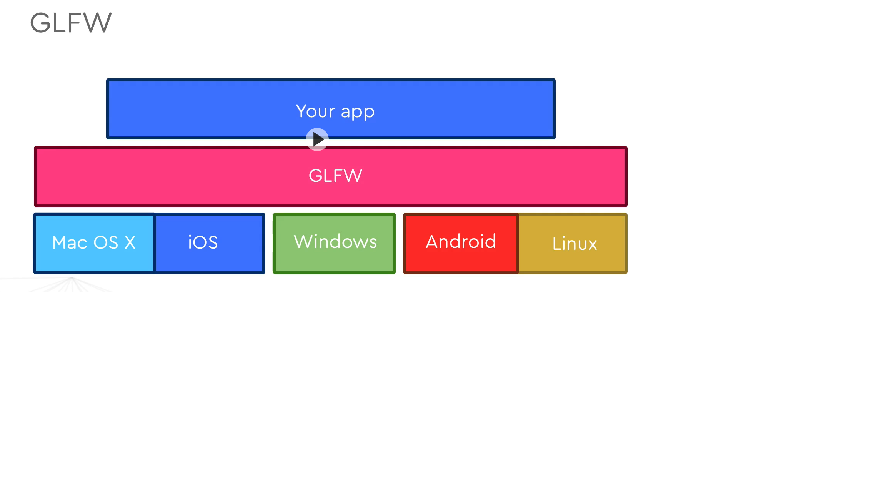
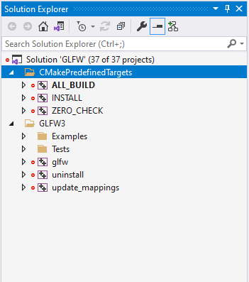
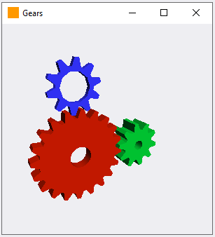

# GLFW Setup

- OpenGL is a cross platform Rendering API.
- Its not reponsible for interfacing with Platform's windowing system.
- In order to draw something we need a window (platform specific), for that we need Platform Native SDKs.

## Platform SDKs
- We can use Cocoa for Macos, NDK for Android, but this would too many options.
- But GLFW we can use for any platform

### Installing GLFW on Windows(VS2019)
- [Install CMake](./https://github.com/Kitware/CMake/releases/download/v3.21.3/cmake-3.21.3-windows-x86_64.msi)
- Download GLFW
  -  `git clone https://github.com/glfw/glfw.git`
-  I clone to `D:\repos\glfw`
-  `D:\repos\glfw>mkdir vs2019`
-  `D:\repos\glfw>cd vs2019\`
-  `cmake -G "Visual Studio 16" ..`
- Solution Explorer Window would look like something this
- 
- It should build fine.
- If we run an Example i took Gears, it should also run properly
- 
